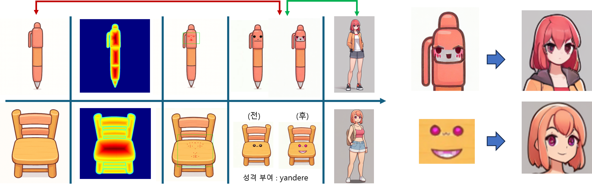
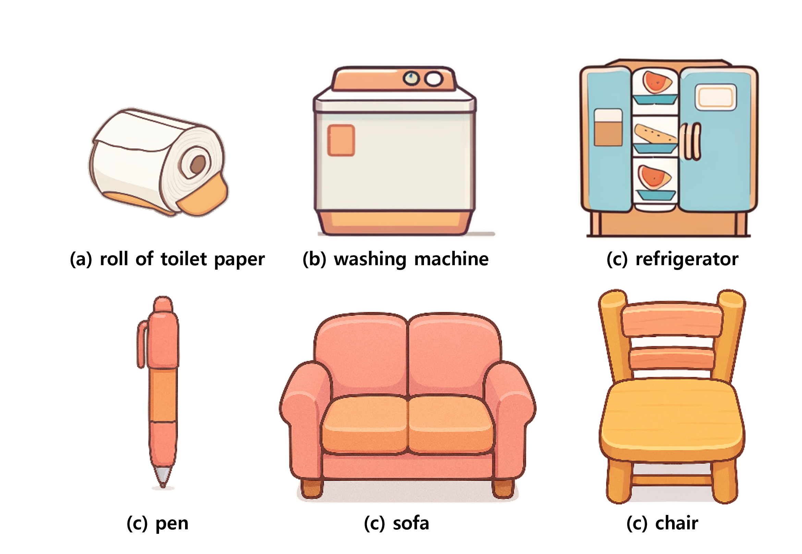
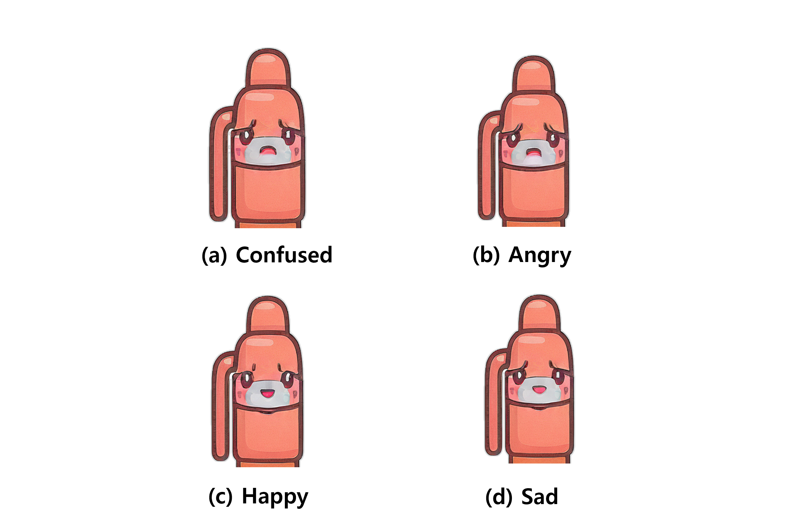

# Generation Module Results

---

## Overall Process

---

## 1. Object Asset Generation (`gen_assets.py`)
객체의 마스크, 에지, 중심 편향 등을 활용해 **Score Map**을 생성하고 오브젝트별 에셋 생성

---

## 2. Facial Modification (`mod_facial.py`)
생성된 객체에 다양한 표정 및 감정을 반영

---

## 3. Human Character Generation (`gen_human.py`)
객체와 연결된 캐릭터를 사람 형태로 변환

---

## 4. Face Generation (`gen_face_v2.py`)
생성된 얼굴을 여러 감정 상태로 다양하게 표현

