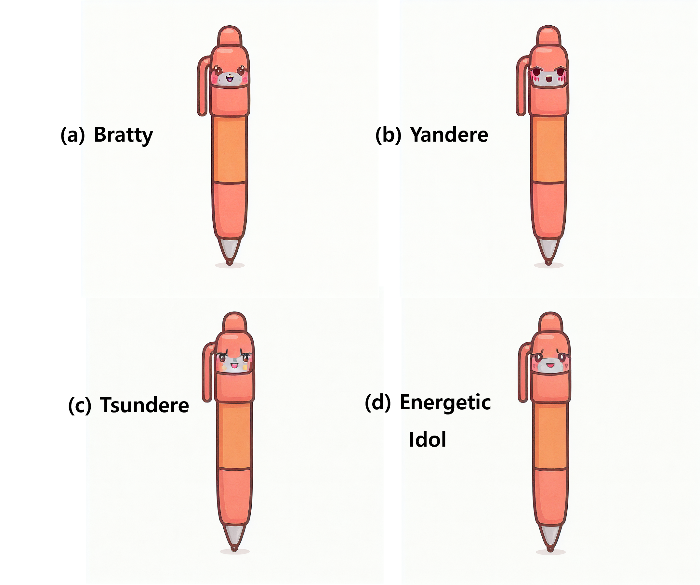

# Generation Module Results

---

## Overall Process


---

## 1. Object Asset Generation (`gen_assets.py`)
객체의 마스크, 에지, 중심 편향 등을 활용해 **Score Map**을 생성하고 오브젝트별 에셋 생성


---

## 2. Facial Modification (`mod_facial.py`)
생성된 객체에 다양한 표정 및 감정을 반영


---

## 3. Human Character Generation (`gen_human.py`)
객체와 연결된 캐릭터를 사람 형태로 변환


---

## 4. Face Generation (`gen_face_v2.py`)
생성된 얼굴을 여러 감정 상태로 다양하게 표현




## References

### gen_face
```bibtex
@misc{zhang2023adding, 
  title={Adding Conditional Control to Text-to-Image Diffusion Models}, 
  author={Lvmin Zhang and Maneesh Agrawala}, 
  year={2023}, 
  eprint={2302.05543}, 
  archivePrefix={arXiv}, 
  primaryClass={cs.CV} 
}

@misc{rombach2021highresolution,
  title={High-Resolution Image Synthesis with Latent Diffusion Models}, 
  author={Robin Rombach and Andreas Blattmann and Dominik Lorenz and Patrick Esser and Björn Ommer},
  year={2021},
  eprint={2112.10752},
  archivePrefix={arXiv},
  primaryClass={cs.CV}
}
```

### gen_object, mod_facial, gen_human
```bibtex
@misc{podell2023sdxlimprovinglatentdiffusion,
  title={SDXL: Improving Latent Diffusion Models for High-Resolution Image Synthesis}, 
  author={Dustin Podell and Zion English and Kyle Lacey and Andreas Blattmann and Tim Dockhorn and Jonas Müller and Joe Penna and Robin Rombach},
  year={2023},
  eprint={2307.01952},
  archivePrefix={arXiv},
  primaryClass={cs.CV},
  url={https://arxiv.org/abs/2307.01952}, 
}

@misc{ye2023ipadaptertextcompatibleimage,
  title={IP-Adapter: Text Compatible Image Prompt Adapter for Text-to-Image Diffusion Models}, 
  author={Hu Ye and Jun Zhang and Sibo Liu and Xiao Han and Wei Yang},
  year={2023},
  eprint={2308.06721},
  archivePrefix={arXiv},
  primaryClass={cs.CV},
  url={https://arxiv.org/abs/2308.06721}, 
}
```